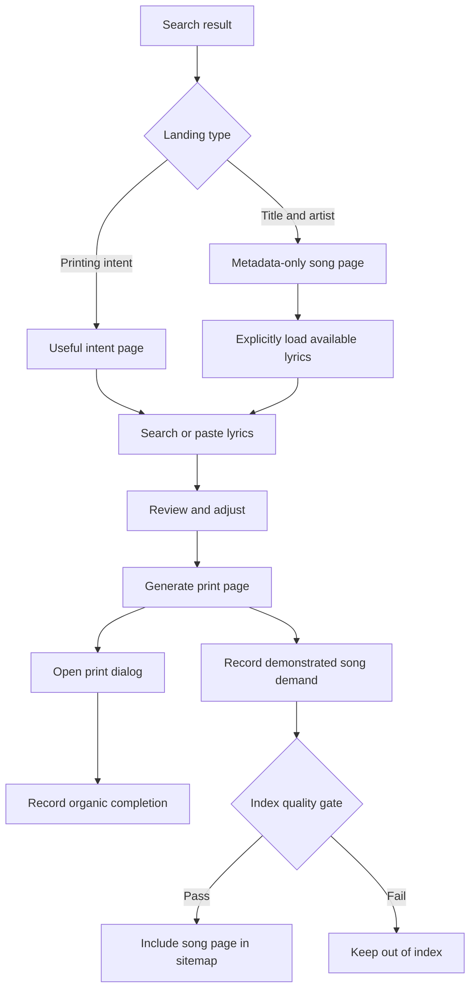
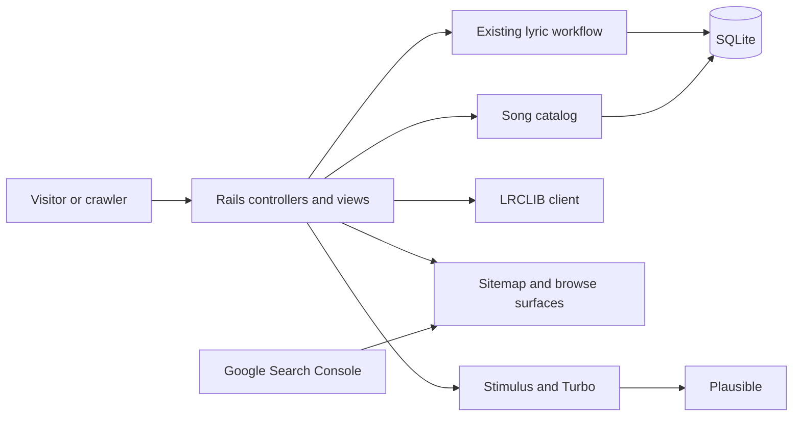
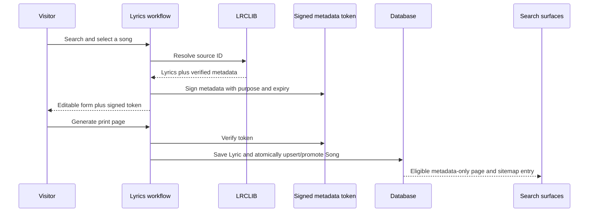
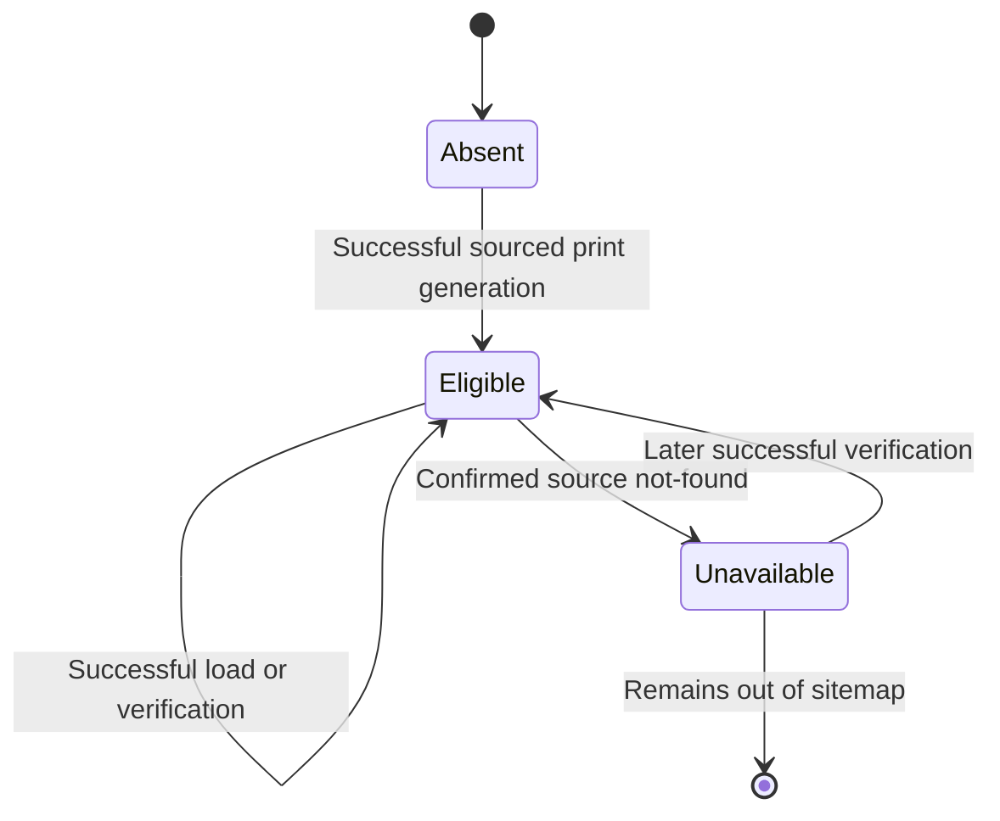
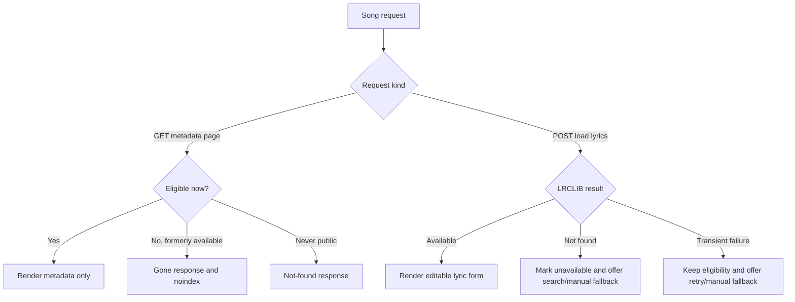
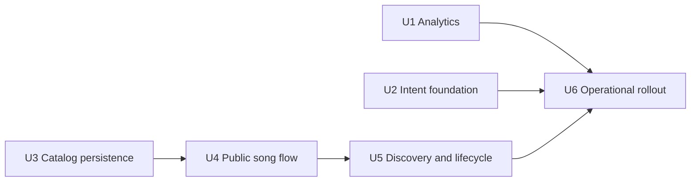

# Organic Search Growth - Plan

## Goal Capsule

- **Objective:** Make PrintLyrics discoverable when people search for a simple tool to print song lyrics, then measure whether those visits produce usable print pages.
- **Product authority:** This plan owns search-facing product content, organic conversion measurement, and demand-led song landing pages. It does not change the core lyric editing or print-preview identity defined in `PRODUCT.md`.
- **Authority order:** Product Contract, session-settled Key Decisions, Planning Contract, Implementation Units, then repository conventions.
- **Execution profile:** Deliver in dependency order, with measurement and intent pages deployable before the demand-led catalog. Keep migrations additive and keep saved lyric URLs backward-compatible.
- **Stop conditions:** Stop if LRCLIB cannot support stable source-ID lookup, if Search Console ownership cannot be assigned to the site owner, or if implementation would require exposing lyric text on an indexable response.
- **Tail ownership:** The implementer owns code, tests, migration safety, and the operational runbook. The site owner owns DNS verification, recurring catalog-verifier scheduling, and 30-/90-day metric reviews.

---

## Product Contract

### Summary

Extend the existing Rails and Stimulus patterns with privacy-safe funnel tracking, one distinct printing guide, and a persisted metadata-only song catalog.
Create catalog entries only after a successful generated print page, then expose eligible songs through crawlable browse, song, and sitemap surfaces.

### Problem Frame

People who want a lyric sheet beside a guitar, in a rehearsal, in a classroom, or for personal reference currently piece together lyrics sites, word processors, and printer settings.
PrintLyrics solves that job, but its only indexable URL is the homepage, so search engines have little crawlable evidence of its use cases or advantages.
The competing opportunity is not to publish a larger lyrics catalog; it is to become the clearest path from search query to a legible printout.

### Key Decisions

- **Serve all three existing audience groups.** (session-settled: user-directed — chosen over prioritizing musicians, teachers, or general listeners: the same focused printing workflow serves each group.) Governs R1, R2.
- **Keep copyrighted lyric text out of indexed pages.** (session-settled: user-directed — chosen over licensing lyrics now or limiting the site to generic queries: title-and-artist pages can expose the tool without publishing lyrics.) Governs R9, R11.
- **Grow through a staged hybrid.** (session-settled: user-directed — chosen over generic-only SEO or a bulk song catalog: useful intent coverage comes first and song coverage follows observed demand.) Governs R3, R8, R12.
- **Measure completed printing intent rather than rankings alone.** The print dialog is the strongest browser-observable completion signal. Governs R5-R7.

### Actors

- A1. **Search visitor:** A musician, teacher, group leader, or listener who wants a printable lyric sheet.
- A2. **Search engine:** Discovers, evaluates, and surfaces index-eligible PrintLyrics pages.
- A3. **Site owner:** Reviews search visibility, organic conversion, and song demand to guide expansion.

### Requirements

**Search-intent foundation**

- R1. The indexable experience must explain the complete job in plain language: find or paste lyrics, adjust the page, and print without an account.
- R2. Search-facing content must address musicians, educators, and personal-use visitors without forcing any group through a separate product experience.
- R3. The site must provide a small, browseable set of pages for materially distinct printing intents, including printing song lyrics and fitting lyrics on one page.
- R4. Every indexable intent page must provide original practical value and a direct path into the working tool; substantially similar keyword-variant or doorway pages are prohibited.

**Measurement**

- R5. Plausible must distinguish organic landings and the funnel events `Song Search Submitted`, `Song Selected`, `Print Page Generated`, and `Print Dialog Opened`.
- R6. Organic print completion is defined as `Print Dialog Opened` during a visit attributed to organic search; the product must not claim that a physical print completed.
- R7. Search Console must report index coverage, queries, impressions, and clicks for all indexable surfaces so funnel outcomes can be interpreted alongside visibility.

**Demand-led song pages**

- R8. A song-specific page may enter the indexable catalog only after a real visitor successfully selects that title and generates a print page.
- R9. An indexable song page may expose verified title, artist, and other non-lyric metadata, but its initial HTML and search snippet must not expose lyric text.
- R10. A song-specific landing must let a visitor load the available lyrics through an explicit action, review or edit them, generate a print page, and open the print dialog without starting a new search.
- R11. A song page is index-eligible only while its metadata resolves to an available source and the printing flow works; unavailable pages must leave the sitemap and stop requesting indexation.
- R12. Song pages must be added from observed demand rather than bulk-importing the source catalog, generating query permutations, or prebuilding pages solely to capture rankings.

**Index quality and discovery**

- R13. Every indexable URL must have a descriptive title, description, canonical URL, crawl directive, and inclusion in the XML sitemap.
- R14. Indexable pages must link to the core tool and to relevant supporting pages using descriptive link text, forming a browseable hierarchy rather than an isolated sitemap-only catalog.
- R15. Saved lyric sheets and user-entered lyric pages must remain `noindex` and excluded from the sitemap.
- R16. Search-facing copy must remain quiet, practical, and subordinate to the tool, consistent with `PRODUCT.md`; it must not become a generic SEO article farm or a feature-heavy SaaS landing page.

### Key Flows

- F1. **Intent discovery**
  - **Trigger:** A1 searches for a lyrics-printing tool or a one-page lyric layout.
  - **Actors:** A1, A2
  - **Steps:** A2 surfaces a relevant intent page; A1 understands the workflow, enters or finds lyrics, generates the page, and opens the print dialog.
  - **Outcome:** A1 receives a useful print sheet and the funnel records an organic completion.
  - **Covers:** R1-R7, R13, R14, R16.
- F2. **Song discovery**
  - **Trigger:** A1 searches for a printable version of a specific song by title and artist.
  - **Actors:** A1, A2
  - **Steps:** A1 lands on the metadata-only song page, explicitly loads available lyrics, reviews the result, generates the page, and opens the print dialog.
  - **Outcome:** The song query reaches the same focused printing workflow without exposing lyrics to the index.
  - **Covers:** R6, R9-R11, R13.
- F3. **Demand-led catalog growth**
  - **Trigger:** A visitor selects a song and successfully generates its print page.
  - **Actors:** A1, A3
  - **Steps:** The title becomes a song-page candidate; its availability and quality are checked; eligible pages join the browseable search surface and sitemap.
  - **Outcome:** Long-tail coverage expands from observed use instead of bulk page generation.
  - **Covers:** R8, R11-R14.

### Acceptance Examples

- AE1. **Covers R5-R7.** Given a visitor arrives from organic search, when they generate a lyric sheet and press Print, then Plausible records both funnel events and attributes `Print Dialog Opened` to organic search.
- AE2. **Covers R6.** Given the browser print dialog opens, when analytics reports the event, then reports call it a print-dialog open or organic print completion and do not assert that paper was printed.
- AE3. **Covers R8-R10, R12.** Given a visitor searches for a title that has no PrintLyrics song page, when they select the match and generate its print page, then that observed use creates an index-eligibility candidate without bulk-generating adjacent songs.
- AE4. **Covers R9, R10.** Given a crawler requests an indexable song page, when the response renders, then it contains useful song metadata and a working load action but no lyric text.
- AE5. **Covers R11, R13.** Given a previously eligible song is no longer available from its source, when eligibility is refreshed, then its URL is removed from the sitemap and no longer requests indexation.
- AE6. **Covers R15.** Given a user pastes private lyrics or generates a shareable sheet, when a crawler requests that tokenized page, then the page remains `noindex` and absent from the sitemap.
- AE7. **Covers R3, R4, R16.** Given two query phrases describe the same printing need, when search-facing pages are reviewed, then the site uses one useful canonical page rather than separate keyword-variant pages.

### Success Criteria

- By 90 days after launch, PrintLyrics records at least 25 `Print Dialog Opened` events from organic-search visits in a rolling 30-day window.
- Search Console shows index coverage for every intended search-facing page and no indexed saved lyric sheets.
- Organic impressions, clicks, generated print pages, and print-dialog opens are reviewed together so higher visibility without successful printing is not treated as success.
- The 90-day target is a calibration baseline; after the first 30 days of reliable event data, the owner may replace it with a conversion-informed target without changing the product scope.

### Scope Boundaries

**Deferred for later**

- Lyrics licensing and indexation of licensed lyric text.
- Broader song-catalog expansion after the demand-led model demonstrates quality and conversion.
- Additional content based on Search Console queries that reveal a distinct unmet printing need.

**Outside this product's identity**

- Bulk-generated song, artist, or keyword-variant pages.
- Generic articles written primarily to increase page count.
- Setlists, performance mode, decorative template libraries, and other expansion that displaces the simple print workflow.
- Claims or guarantees of attaining a particular search ranking.

### Dependencies and Assumptions

- Plausible remains the product analytics system and can report custom events with acquisition source.
- Google Search Console access can be established for `printlyrics.app`.
- The lyric source continues to provide stable identifiers and non-lyric metadata for demand-led pages.
- Keeping lyric text out of indexed responses reduces search and publication exposure but does not replace legal review, source compliance, or a takedown process.
- Search growth depends partly on external discovery and links; on-site changes alone cannot guarantee rankings.

### Sources and Research

- `PRODUCT.md` defines the users, product purpose, brand personality, and anti-references.
- `app/views/lyrics/new.html.erb` contains the current indexable homepage and structured data.
- `app/views/lyrics/show.html.erb` keeps generated lyric sheets out of the index.
- `app/controllers/sitemaps_controller.rb` currently publishes only the homepage.
- `app/views/layouts/application.html.erb` provides the existing Plausible installation.
- [Google Search SEO Starter Guide](https://developers.google.com/search/docs/fundamentals/seo-starter-guide) emphasizes useful, original, people-first content and browseable discovery.
- [Google Search spam policies](https://developers.google.com/search/docs/essentials/spam-policies) prohibit doorway abuse and scaled content created primarily to manipulate rankings.
- [Google sitemap guidance](https://developers.google.com/search/docs/crawling-indexing/sitemaps/build-sitemap) recommends listing URLs intended to appear in search.
- [U.S. Copyright Office: Musical Works](https://copyright.gov/engage/docs/recording.pdf) identifies accompanying lyrics as part of a protected musical work.

Product Contract unchanged.

---

## Planning Contract

### Key Technical Decisions

- KTD1. **Treat a successful generated print page as the catalog admission event.** (session-settled: user-approved — chosen over persisting search selections: abandoned searches must not grow the public catalog.) A purpose-scoped, expiring Rails-signed token carries source-verified metadata from selection to creation; only a successful `Lyric` transaction upserts and promotes the associated `Song`. Implements R8 and R12.
- KTD2. **Make `Song` the authority for public-page identity and index eligibility.** Store the LRCLIB source ID, an immutable source-ID-suffixed slug, non-lyric metadata, successful generation count, verification timestamps, and unavailability state behind database uniqueness and null constraints. `Lyric` gains an optional association with no dependent deletion, so catalog history outlives expired sheets while existing manual and tokenized pages remain valid. Implements R8, R9, R11, and R12.
- KTD3. **Keep lyrics behind an explicit non-GET load action.** A public song GET renders verified metadata and navigation only; its load action fetches LRCLIB at request time and enters the existing editable lyric form. Crawlers receive no lyrics from the indexable response. Implements R9 and R10.
- KTD4. **Use explicit Turbo-aware Plausible instrumentation with redacted locations.** Disable automatic pageviews, emit pageviews on `turbo:load`, and replace token-bearing paths such as `/lyrics/abc123` with the literal synthetic location `/lyrics/:token`; custom events carry only low-cardinality workflow context. Implements R5, R6, and R15.
- KTD5. **Let the homepage own generic printing intent and add one distinct one-page guide.** (session-settled: user-approved — chosen over multiple keyword-variant pages: each indexed page must own a materially different job.) The guide teaches practical fitting choices and links into the same tool. Implements R1-R4 and R16.
- KTD6. **Refresh catalog availability through a bounded rake task and request-time checks.** (session-settled: user-approved — chosen over adding a queue or scheduler: the deployment has no background-job infrastructure.) A confirmed source not-found demotes a song; transient source failures preserve its last known state. Implements R11.
- KTD7. **Use a Domain property in Google Search Console.** DNS verification covers the canonical domain and any protocol/subdomain variants; the operational runbook owns verification, sitemap submission, and baseline capture. Implements R7 and R13.

### High-Level Technical Design

These diagrams set boundaries and direction. They are not prescribed class or method signatures.

#### Component topology

#### Demand-to-index data flow

#### Song index lifecycle

#### Request and error decisions

### Implementation Constraints

- Keep all lyric text, share tokens, titles, artists, and search queries out of analytics event properties.
- Do not persist a `Song` during search or selection; the signed catalog token is the only promotion input accepted from the browser.
- Use `ActiveSupport::MessageVerifier` with a dedicated purpose and a short expiry. Signing provides integrity, not secrecy, so the payload contains non-sensitive source metadata only.
- Derive the immutable slug once from normalized artist, title, and source ID. Metadata refreshes must not change the public URL.
- Increment demand counts and set first eligibility inside the same database transaction that saves the sourced `Lyric`; lock or atomic update semantics must make concurrent generations safe.
- Keep existing `Lyric` token URLs, 180-day retention, `noindex, nofollow`, and sitemap exclusion unchanged.
- Only a definitive LRCLIB not-found response may demote a song. Timeouts, malformed responses, and service errors must retain the previous availability state.
- Sitemap `lastmod` must change only when public metadata or eligibility changes, not on a verifier heartbeat that only advances `last_verified_at`.
- Paginated catalog pages use self-canonical URLs and ordinary crawlable links; choose a fixed page size of 50.
- Structured data must describe only metadata visible in the response and must not imply that PrintLyrics publishes lyrics.

### Sequencing

1. Ship U1 and U2 first so organic traffic and conversion can be measured before expanding indexable inventory.
2. Add the persistence and signed-promotion boundary in U3 before exposing public song routes.
3. Add public song behavior in U4, then discovery and lifecycle automation in U5.
4. Complete U6 before submitting the expanded sitemap or treating the 90-day window as started.

### System-Wide Impact

- **Data lifecycle:** `Song` records outlive expiring `Lyric` records because they represent aggregate demand and public metadata, not saved lyric content.
- **Privacy:** Analytics uses synthetic token-page locations and aggregate event context; no new user identity or cross-session profile is introduced.
- **External dependency:** Public song loading and catalog verification depend on LRCLIB, but transient outages do not erase indexed state.
- **Performance:** Song browse and sitemap queries operate on indexed eligibility and slug columns and paginate rather than loading the entire catalog into views.
- **SEO integrity:** Canonical, robots, structured-data, internal-link, and sitemap rules share `Song#indexable?` as their eligibility boundary.

### Risks and Mitigations

- **Thin-page risk:** Metadata-only song pages may not earn rankings. Mitigate with demand-only admission, useful direct loading, browse context, and Search Console review; remove or revise pages that remain excluded as low value.
- **Doorway/scaled-content risk:** A catalog can drift into keyword inventory. Mitigate by prohibiting pre-generation persistence and bulk imports under R4 and R12.
- **Copyright/source risk:** Excluding lyrics from indexed HTML lowers exposure but does not settle legal or source-terms questions. Keep the takedown/source-compliance issue deferred and stop if source usage terms conflict with the flow.
- **Analytics duplication:** Turbo visits and controller reconnects can double count. Use a single pageview listener and one-shot success markers covered by system tests.
- **Token leakage:** Default analytics could disclose share URLs. Manual location redaction is a release gate, not an optional enhancement.
- **Stale availability:** A host scheduler may be missed. The runbook includes a bounded command, cadence, last-run query, and manual recovery.

### Documentation and Operational Notes

- Add `docs/organic-search-operations.md` with Search Console Domain-property setup, sitemap submission, Plausible goal definitions, organic funnel segments, verifier scheduling, rollback, and 30-/90-day review instructions.
- The 90-day clock starts only after production analytics events are validated, Search Console ownership is active, and the expanded sitemap is submitted.
- Run the catalog verifier from host scheduling or the existing deployment operator; add a Kamal alias but no in-app scheduler.
- Record the pre-launch Search Console totals and Plausible organic funnel baseline, even when each is zero.

### Research Basis

- Existing controller-domain-object boundaries in `app/controllers/lyrics_controller.rb`, `app/models/song_search.rb`, and `app/models/song_lookup.rb` support keeping orchestration out of controllers.
- Existing `Lyric` retention and `noindex` behavior in `app/models/lyric.rb` and `app/views/lyrics/show.html.erb` remains the privacy boundary for saved sheets.
- [Plausible custom events](https://plausible.io/docs/custom-event-goals), [custom properties](https://plausible.io/docs/custom-props/for-custom-events), [custom locations](https://plausible.io/docs/custom-locations), and [script extensions](https://plausible.io/docs/script-extensions) support manual Turbo pageviews, event properties, and URL redaction.
- [Rails `ActiveSupport::MessageVerifier`](https://api.rubyonrails.org/classes/ActiveSupport/MessageVerifier.html) supports purpose-scoped, expiring signed messages.
- [Google crawlable-link guidance](https://developers.google.com/search/docs/crawling-indexing/links-crawlable), [canonical guidance](https://developers.google.com/search/docs/crawling-indexing/consolidate-duplicate-urls), and [robots guidance](https://developers.google.com/search/docs/crawling-indexing/robots-meta-tag) shape the browse and lifecycle rules.

---

## Implementation Units

### U1. Add privacy-safe organic conversion instrumentation

- **Goal:** Make pageviews and the complete search-to-print funnel reliable under Turbo without exposing lyric tokens or high-cardinality song data.
- **Requirements:** R5, R6, R15; AE1, AE2, AE6; KTD4.
- **Dependencies:** None.
- **Files:** `app/views/layouts/application.html.erb`, `app/javascript/application.js`, `app/javascript/lib/analytics.js`, `app/javascript/controllers/lyric_search_controller.js`, `app/javascript/controllers/preview_controller.js`, `app/views/lyrics/new.html.erb`, `app/views/lyrics/show.html.erb`, `test/application_system_test_case.rb`, `test/system/organic_conversion_test.rb`, `test/integration/lyrics_flow_test.rb`, `config/ci.rb`, `.github/workflows/ci.yml`.
- **Approach:** Centralize Plausible initialization, manual pageviews, token-path redaction, and custom-event dispatch in one browser module. Add stable DOM hooks for search submission, successful selection, successful generated-page arrival, and the print action. Deduplicate generated-page events across Turbo cache restoration without treating a later print click as a duplicate.
- **Test scenarios:**
  - Given an organic referrer and a search submission, the browser records one search event and retains Plausible's acquisition context.
  - Given a successful Turbo selection response, the browser records one selection event; an error response records none.
  - Given creation redirects to a token URL, the browser records one generation event at `/lyrics/:token`; reconnecting or restoring the page does not repeat it.
  - Given the visitor presses Print, the print-dialog event is dispatched immediately before the stubbed `window.print`.
  - Given analytics calls from a tokenized page, no real token, lyric text, query, title, or artist appears in the captured payload.
- **Verification:** System tests spy on `window.plausible` and `window.print`; integration tests assert the required hooks and manual initialization are rendered.

### U2. Build the indexable printing-intent foundation

- **Goal:** Give broad and one-page printing queries distinct, useful landing experiences that lead directly into the tool.
- **Requirements:** R1-R4, R13, R14, R16; F1; AE7; KTD5.
- **Dependencies:** None.
- **Files:** `config/routes.rb`, `app/controllers/printing_guides_controller.rb`, `app/controllers/sitemaps_controller.rb`, `app/views/printing_guides/one_page.html.erb`, `app/views/lyrics/new.html.erb`, `app/views/shared/_search_navigation.html.erb`, `app/helpers/application_helper.rb`, `app/assets/tailwind/application.css`, `test/integration/printing_guides_test.rb`, `test/integration/lyrics_flow_test.rb`, `test/integration/sitemap_test.rb`.
- **Approach:** Expand the homepage below the working form with compact workflow and audience guidance. Add `/print-lyrics-on-one-page` for practical font-size, columns, margin, preview, and browser-print guidance. Reuse the existing visual language, add crawlable navigation between the homepage and guide, and include both in the sitemap in this independently deployable unit.
- **Test scenarios:**
  - The homepage describes search-or-paste, editing, layout, printing, no-account use, and the three audience contexts without displacing the form.
  - The one-page guide has a unique title, description, H1, self-canonical URL, index directive, and direct tool link.
  - Search navigation uses real anchor links with descriptive text, introduces no link to an unavailable future route, and is absent from the printable token page.
  - The sitemap includes the homepage and one-page guide as soon as the guide becomes indexable.
  - No second page targets a mere wording variant of the generic printing job.
- **Verification:** Integration assertions cover metadata, canonical ownership, links, and copy boundaries; browser inspection confirms mobile and desktop layout remain tool-first.

### U3. Add demand-led song persistence and signed promotion

- **Goal:** Persist public song metadata only when a sourced lyric sheet is successfully generated.
- **Requirements:** R8, R9, R12, R15; F3; AE3, AE6; KTD1, KTD2.
- **Dependencies:** None.
- **Files:** `db/migrate/*_create_songs.rb`, `db/migrate/*_add_song_to_lyrics.rb`, `db/schema.rb`, `app/models/song.rb`, `app/models/lyric.rb`, `app/models/song_catalog_token.rb`, `app/models/lyric_page_creation.rb`, `app/models/song_lookup.rb`, `app/controllers/lyrics_controller.rb`, `app/views/lyrics/new.html.erb`, `test/models/song_test.rb`, `test/models/song_catalog_token_test.rb`, `test/models/lyric_page_creation_test.rb`, `test/models/song_lookup_test.rb`, `test/integration/lyrics_flow_test.rb`.
- **Approach:** Add an additive `songs` table and nullable `lyrics.song_id`. Have successful source lookup produce a signed metadata token. Replace direct controller persistence with a domain operation that verifies the token and transactionally saves the `Lyric`, upserts the source-ID song, associates it, increments demand, and sets first eligibility. Invalid or expired tokens still allow manual lyric creation but cannot set a source URL, association, or catalog state.
- **Test scenarios:**
  - Searching and selecting a source result creates neither a `Song` nor a `Lyric`.
  - Generating with a valid token creates one lyric, one eligible song, the association, and a count of one.
  - A second or concurrent generation for the same source ID reuses the song, increments safely, and leaves the slug unchanged.
  - Edited form title or artist affects the saved lyric only; source-verified song metadata and slug remain unchanged.
  - A forged, expired, or wrong-purpose token produces a manual lyric page without catalog promotion or trusted source URL.
  - Existing manual creation and existing lyric records without `song_id` continue to work.
- **Verification:** Model and integration tests prove transaction rollback, uniqueness, token purpose/expiry, concurrent-safe promotion, and backward compatibility; migration runs forward on a populated test database.

### U4. Add metadata-only song browse and load flows

- **Goal:** Let title-and-artist search visitors enter the existing editable workflow from a useful public song page without serving lyrics to crawlers.
- **Requirements:** R9-R11, R13, R14; F2; AE4, AE5; KTD2, KTD3.
- **Dependencies:** U3.
- **Files:** `config/routes.rb`, `app/controllers/songs_controller.rb`, `app/models/song.rb`, `app/models/song_lookup.rb`, `app/views/songs/index.html.erb`, `app/views/songs/show.html.erb`, `app/views/songs/gone.html.erb`, `app/views/lyrics/new.html.erb`, `app/views/shared/_search_navigation.html.erb`, `app/helpers/application_helper.rb`, `app/assets/tailwind/application.css`, `test/integration/songs_flow_test.rb`.
- **Approach:** Add `/songs`, self-canonical pagination, `/songs/:slug`, and a POST-only load action. Extend the shared search navigation with the now-live song browse route. Render visible metadata, breadcrumbs, structured data, and a direct load button on eligible GET pages. On load success, render the existing editable form with a new signed token; on confirmed not-found, demote and return a gone/noindex response; on service failure, preserve eligibility and show retry plus manual-search fallback.
- **Test scenarios:**
  - An eligible song GET contains title, artist, optional album/duration, direct load form, canonical/robots metadata, breadcrumbs, and matching structured data but no lyric text.
  - A crawler-style GET never calls LRCLIB and cannot trigger lyric loading.
  - A successful POST load calls LRCLIB, refreshes verified metadata, and renders the editable lyric form without persisting a lyric.
  - A confirmed source not-found demotes the song and subsequent GETs return the gone/noindex surface.
  - A timeout or service error leaves the song eligible and offers retry and manual fallback.
  - An empty catalog explains that pages appear after successful use, links to the tool, and renders no pagination controls.
  - Browse pages contain 50 or fewer eligible songs, self-canonical pagination, and ordinary previous/next and song links.
- **Verification:** Integration tests use injected fake LRCLIB clients to prove response content, source-call boundaries, status branches, metadata refresh, and absence of lyrics from all indexable GETs.

### U5. Connect sitemap discovery and catalog availability lifecycle

- **Goal:** Keep every intended public URL discoverable while removing definitively unavailable songs from indexing signals.
- **Requirements:** R11, R13-R15; F3; AE5, AE6; KTD2, KTD6.
- **Dependencies:** U4.
- **Files:** `app/controllers/sitemaps_controller.rb`, `app/models/song.rb`, `app/models/song_catalog_verifier.rb`, `lib/tasks/songs.rake`, `config/deploy.yml`, `test/integration/sitemap_test.rb`, `test/models/song_catalog_verifier_test.rb`, `test/tasks/songs_rake_test.rb`.
- **Approach:** Extend the existing homepage-and-guide sitemap with song browse pages and eligible song records, using `lastmod` where available. Add a verifier that visits the least-recently-checked eligible or unavailable records in bounded batches, refreshes metadata on success, demotes only on definitive not-found, and records no false unavailability on service errors. Expose it as `songs:verify_catalog` with a configurable batch limit and a Kamal alias.
- **Test scenarios:**
  - The sitemap includes every generic/indexable page, required browse page, and eligible song exactly once with canonical absolute URLs.
  - Saved lyric URLs, noneligible records, and unavailable song pages never enter the sitemap.
  - Verification success refreshes metadata and can reactivate an unavailable song without changing its slug.
  - A verification that changes only `last_verified_at` does not advance the sitemap's material `lastmod`.
  - Confirmed not-found demotes an eligible song; transient failure preserves status and makes the task continue to later records.
  - The batch limit is enforced and oldest/unverified records are processed first.
- **Verification:** Integration tests parse the XML; model/task tests cover ordering, limits, error isolation, reactivation, and idempotent repeated runs.

### U6. Operationalize acquisition measurement and rollout

- **Goal:** Make the launch observable, repeatable, and reviewable without claiming a ranking guarantee.
- **Requirements:** R5-R7, R11, R13; AE1, AE2; KTD6, KTD7.
- **Dependencies:** U1, U2, U5.
- **Files:** `docs/organic-search-operations.md`, `README.md`.
- **Approach:** Document Search Console DNS verification and sitemap submission, Plausible goal/funnel configuration, production event validation, verifier scheduling, baseline capture, 30-day calibration, 90-day target review, alert symptoms, and rollback. Link the runbook from the repository's operating documentation.
- **Test scenarios:**
  - A fresh operator can verify the Domain property, submit the sitemap, define the four events, and reproduce the organic completion segment from the runbook.
  - The runbook distinguishes print-dialog opens from physical prints and records the 25-in-30-days target as a calibration baseline.
  - The verifier procedure documents cadence, bounded invocation, last-run evidence, failure handling, and safe manual retry.
  - Rollback removes new indexable URLs from the sitemap and applies noindex/gone behavior without changing saved lyric pages.
- **Verification:** A second-person dry run or equivalent checklist walkthrough confirms every external-console and scheduling step has an owner, expected result, and recovery path.

---

## Verification Contract

### Automated Gates

Run from the repository root in this order:

1. `bin/rails db:migrate`
2. `bin/rails test`
3. `bin/rails test:system`
4. `bin/rubocop`
5. `bin/brakeman --no-pager`
6. `bin/bundler-audit`
7. `bin/importmap audit`
8. `RAILS_ENV=production SECRET_KEY_BASE_DUMMY=1 bin/rails assets:precompile`
9. `bin/ci`

`bin/ci` must include the system-test step after U1 establishes a stable harness. No gate may require live LRCLIB, Plausible, or Google access; tests use deterministic fakes or browser spies.

### Behavioral Gates

- Complete the manual-entry flow and a sourced search-selection flow in a real browser at mobile and desktop widths.
- Confirm the print preview still changes size and columns and that the analytics event precedes the native print call.
- Inspect rendered source for the homepage, guide, song browse, eligible song, unavailable song, and tokenized lyric page; verify each canonical/robots combination and confirm lyrics appear only on the tokenized page.
- Parse the production-like sitemap and follow each listed URL without authentication or JavaScript.
- In a production smoke test, use browser developer tools or Plausible live events to confirm four custom events, one pageview per Turbo visit, organic attribution, and token-path redaction.
- Validate structured data against the rendered visible metadata; treat warnings as review inputs, not rich-result guarantees.

### Migration and Rollback Gates

- Apply migrations to a copy of a populated database and prove existing `Lyric` rows remain readable with `song_id = NULL`.
- Roll back and reapply both migrations in development before deployment.
- Before public catalog launch, confirm a rollback can exclude guide/catalog routes from the sitemap and mark public catalog pages nonindex/gone without deleting song records or saved lyric sheets.

### Operational Gates

- Search Console Domain property is verified and the sitemap reports a successful fetch.
- Plausible goals and organic funnel segment are configured from the exact production event names.
- A host scheduler owns `songs:verify_catalog`; its first successful run and next scheduled time are recorded.
- Capture launch-day Search Console and Plausible baselines. Start the 90-day measurement window only after these gates pass.

---

## Definition of Done

### Global

- Every requirement and acceptance example is implemented or explicitly preserved as an operational gate.
- All automated, behavioral, migration, and applicable operational gates pass.
- Indexable GET responses never contain lyric text, saved lyric tokens, or analytics payloads with high-cardinality song data.
- Existing tokenized lyric pages retain their URLs, retention behavior, print controls, and `noindex` status.
- New migrations are additive, reversible, and validated against existing data.
- Search-facing content remains tool-first and materially distinct across canonical pages.
- Dead-end experiments, temporary instrumentation, stale comments, and abandoned migration/code paths are removed from the final diff.
- The runbook names owners and recovery steps for every external-console and recurring task.

### Per Unit

- U1 is done when system tests prove one-shot Turbo funnel events, organic attribution compatibility, print ordering, and token-location redaction.
- U2 is done when the homepage and one-page guide pass metadata, crawlable-link, distinct-intent, responsive-layout, and tone review.
- U3 is done when only a successful valid-token generation can atomically create or promote a stable-slug song and all existing lyric behavior remains compatible.
- U4 is done when public song GETs are metadata-only, direct loading enters the editable workflow, and not-found versus transient source failures produce the specified lifecycle behavior.
- U5 is done when sitemap membership and bounded verification use one eligibility rule and tests prove demotion, error isolation, and reactivation.
- U6 is done when Search Console, Plausible, verifier scheduling, baselines, and the 30-/90-day review procedure are reproducible from the runbook.
